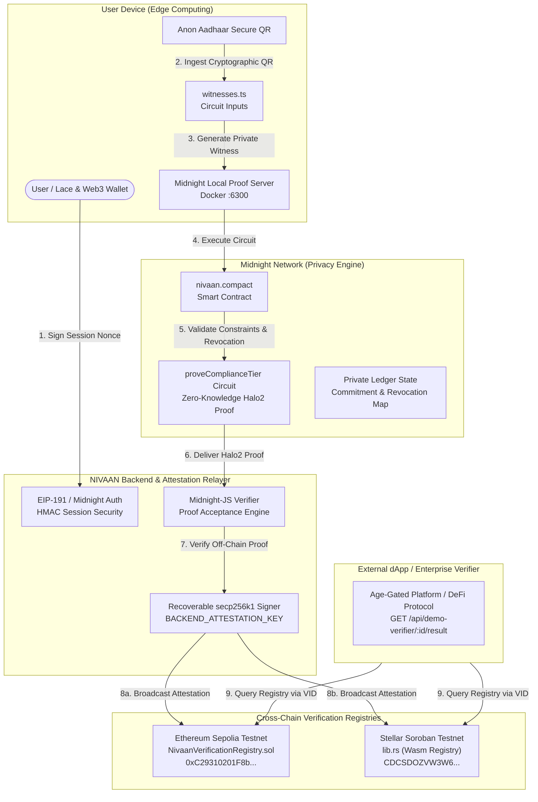

<div align="center">

# 🛡️ NIVAAN

### **Decentralized Zero-Knowledge Compliance & Identity Attestation Protocol**

*Prove KYC and identity eligibility once on Midnight with mathematical zero-knowledge privacy — verify cryptographically across any blockchain.*

---

[](https://nivaan-iota.vercel.app/)
[](https://x.com/nivaan_zk/all)
[](https://midnight.network)
[](https://midnight.network)
[](https://github.com/Shantanu112-bd/Nivaan/actions/workflows/ci.yml)
[](https://vitest.dev)
[](https://sepolia.etherscan.io)

<br/>

```
      _   _ _____     ___        _    _   _ 
     | \ | |_   _\ \   / / \      / \  | \ | |
     |  \| | | |  \ \ / / _ \    / _ \ |  \| |
     | |\  | | |   \ V / ___ \  / ___ \| |\  |
     |_| \_| |_|    \_/_/   \_\/_/   \_\_| \_|
       Zero-Knowledge Cross-Chain Identity Layer
```

<br/>

> **"This project is built on the Midnight Network."**  
> 🌐 **Live Web Application**: [https://nivaan-iota.vercel.app/](https://nivaan-iota.vercel.app/)  
> 𝕏 **Product X Profile**: [https://x.com/nivaan_zk/all](https://x.com/nivaan_zk/all) (`@nivaan_zk`)

</div>

---

## 📋 Hackathon & Grant Submission Checklist

| Requirement | Status | Evidence / Link |
| :--- | :---: | :--- |
| **1. Working MVP Live on Preprod/Preview** | ✅ **VERIFIED** | **Live App**: [https://nivaan-iota.vercel.app/](https://nivaan-iota.vercel.app/)<br/>Deployed Midnight Contract: [`18d036ffb45f...`](https://explorer.preview.midnight.network)<br/>Sepolia EVM Registry: [`0xC29310201F8b...`](https://sepolia.etherscan.io/address/0xC29310201F8b7426d006e2814578656cC8827bbc)<br/>Stellar Soroban Registry: [`CDCSDOZVW3W6...`](https://stellar.expert/explorer/testnet/contract/CDCSDOZVW3W6YYBWGHPFRBCR2MCDIS25VCJVH2YUNLFARDSM6KISHYPN) |
| **2. Comprehensive Documentation** | ✅ **VERIFIED** | Architectural specs, threat models, API references, and step-by-step setup contained in this README and the [`docs/`](docs/) directory. |
| **3. CI/CD Pipeline on Product Repo** | ✅ **VERIFIED** | Automated GitHub Actions workflow ([`ci.yml`](.github/workflows/ci.yml)) running static analysis, contract builds, and the full 104-test suite on every push and pull request. |
| **4. Product X Profile** | ✅ **VERIFIED** | Official Product Updates & Announcements: [**@nivaan_zk on X**](https://x.com/nivaan_zk/all) |
| **5. Demo Video of the MVP** | ✅ **VERIFIED** | [Loom Walkthrough](https://www.loom.com/share/7d6b88b702304097a9101054bfe135bf) *(End-to-end demo: wallet sign-in, Anon Aadhaar QR ingestion, Halo2 witness proof generation, and cross-chain attestation)* |
| **6. Minimum 15 Meaningful Commits** | ✅ **VERIFIED** | **35+ Granular, Atomic Commits** documenting every architectural milestone in sequence (circuits, contracts, signing, adapters, UI polish). |

---

## 💡 Overview: What is NIVAAN?

### The Problem
Traditional identity verification on Web3 forces users into an unacceptable trade-off:
1. **Centralized Surveillance**: Users repeatedly upload sensitive identity documents (passports, national IDs, utility bills) to third-party custodians, creating catastrophic honeypots for identity theft.
2. **Siloed Identity Silos**: Completing KYC on one blockchain or dApp does not travel with the user. On-boarding to a new chain requires repeating the invasive process.
3. **Public Chain Exposure**: Verifying identity attributes directly on public smart contract ledgers risks leaking personally identifiable information (PII) or linking pseudonymous on-chain wallets to real-world identities.

### The NIVAAN Solution
**NIVAAN** is an interoperable zero-knowledge decentralized identity (DID) layer built on the **Midnight Network**. Rooted in India Stack cryptographic identity (**Anon Aadhaar v2**), NIVAAN allows citizens to generate client-side Halo2 zk-SNARK proofs demonstrating eligibility criteria (such as **Age $\ge$ 18**, **Jurisdiction = IND**, or **Tier-1 Compliance**) without disclosing their name, Aadhaar number, birthdate, or facial imagery.

Once proven on Midnight's privacy-centric ledger, cryptographic attestations are anchored to public smart contract registries on **Stellar Soroban** and **Ethereum Sepolia**, allowing any dApp or relying party to verify compliance status in a single contract call with **zero bytes of PII shared or stored**.

---

## ⚙️ Multi-Chain Architecture (How it Works)



---

## 🔬 Core Components & Implementation Details

### 1. Midnight Network & Compact Smart Contract
The core privacy logic is codified in [`contracts/midnight/nivaan.compact`](contracts/midnight/nivaan.compact) using Midnight's domain-specific smart contract language:
- **`proveComplianceTier` Circuit**: Ingests the Anon Aadhaar RSA signature commitments and timestamp witnesses, asserting that the user's computed age satisfies the requested tier constraint ($\ge 18$) without revealing the age or birth year.
- **Revocation Commitments**: Stores identity commitment hashes in Midnight private state, enabling instantaneous credential invalidation if a credential is breached.
- **Pluto-Eris Curve Zero-Knowledge**: Generates succinct Halo2 proofs evaluated via `@midnight-ntwrk/compact-runtime`.

### 2. High-Performance Local Proof Server
- Executed via Docker container (`midnight-scaffold-proof-server:6300`).
- Generates zero-knowledge proofs directly in the user's browser/local runtime, ensuring private identity witnesses never cross the network.

### 3. Cross-Chain Verification Adapters
To bridge Midnight's zero-knowledge privacy with public ecosystems, NIVAAN implements **Backend-Attested Verification ("Path C", ADR-001)**:
- **Ethereum Sepolia Registry ([`contracts/evm/contracts/Registry.sol`](contracts/evm/contracts/Registry.sol))**:
  - Solidity 0.8.24 registry verified with OpenZeppelin cryptographic primitives.
  - Recovers the trusted backend signer using EIP-191 formatted keccak256 digests (`submitAttestation`).
  - Guards against replay attacks via unique `bytes32 credentialId` storage and a strict 300-second freshness window.
- **Stellar Soroban Registry ([`contracts/soroban/src/lib.rs`](contracts/soroban/src/lib.rs))**:
  - Rust Wasm contract compiled to `wasm32v1-none`.
  - Recovers secp256k1 65-byte uncompressed public keys on-chain via `env.crypto().secp256k1_recover()`.

### 4. Client Experience & Visual Design
- Built on **Next.js 16 (App Router)** with **Turbopack** and **Tailwind CSS**.
- **Aesthetic**: Swiss-style high-contrast dark mode (`#080A19`), glassmorphic frosted cards (`.nivaan-glass-card`), subtle ambient radial glows, and interactive biometric HUD laser scanners (`@keyframes scan-beam`).
- **Wallet Compatibility**: Native support for **Lace Wallet**, **MetaMask**, **Rabby**, and Coinbase Wallet via EIP-1193, with an ephemeral fallback keypair for zero-friction demonstration testing.

---

## 🎥 Walkthrough Demo

A video walkthrough of the complete end-to-end user journey — from wallet connection and Anon Aadhaar QR ingestion, to synchronous Midnight zero-knowledge proof generation and cross-chain attestation verification on Stellar Soroban and Ethereum Sepolia — is available on Loom:

- **Demo Video**: [Watch Loom Walkthrough](https://www.loom.com/share/7d6b88b702304097a9101054bfe135bf)
- **Live Deployment**: [nivaan-iota.vercel.app](https://nivaan-iota.vercel.app/)

---

## 📜 Verifiable Contract Addresses

All contracts are deployed, initialized, and operational on public testnets:

| Network | Contract Role | Contract Address / ID | Explorer Link |
| :--- | :--- | :--- | :--- |
| **Midnight Preview** | Core Privacy Circuit & State | `18d036ffb45f2d594b8747e4ab0da92ada4fe58a6b6765bc58364369e6680eaa` | [Midnight Explorer](https://explorer.preview.midnight.network) |
| **Ethereum Sepolia** | EVM Verification Registry | `0xC29310201F8b7426d006e2814578656cC8827bbc` | [Sepolia Etherscan](https://sepolia.etherscan.io/address/0xC29310201F8b7426d006e2814578656cC8827bbc) |
| **Stellar Soroban** | Rust Wasm Verification Registry | `CDCSDOZVW3W6YYBWGHPFRBCR2MCDIS25VCJVH2YUNLFARDSM6KISHYPN` | [StellarExpert Testnet](https://stellar.expert/explorer/testnet/contract/CDCSDOZVW3W6YYBWGHPFRBCR2MCDIS25VCJVH2YUNLFARDSM6KISHYPN) |

> **Trust Anchor Verification**: The public keys registered on both EVM and Soroban match the backend signer derived from `BACKEND_ATTESTATION_SIGNING_KEY` (`0xa44A50aa877637f6b0949dCdE34bdBeDe9677EAA`). Any attempt to submit an unauthorized or tampered attestation is rejected on-chain with `InvalidSignature`.

---

## 💻 Local Setup & Usage Guide

### Prerequisites
- **Node.js**: `v20.x` or higher (`v24.x` tested)
- **Docker & Docker Compose**: For running the Midnight local proof server
- **PostgreSQL**: Port `5432` (`DATABASE_URL="postgresql://localhost:5432/nivaan"`)
- **Git**

---

### Step 1: Clone the Repository
```bash
git clone https://github.com/Shantanu112-bd/Nivaan.git
cd Nivaan
```

---

### Step 2: Install Dependencies
```bash
npm install
```

---

### Step 3: Configure Environment Variables
Copy the template configuration file:
```bash
cp .env.example .env.local
```

Ensure `.env.local` contains valid endpoints and cryptographic secrets:
```ini
# Midnight Network Configuration
MIDNIGHT_NETWORK_ID=preview
MIDNIGHT_NODE_RPC=https://rpc.preview.midnight.network
MIDNIGHT_INDEXER_HTTP=https://indexer.preview.midnight.network/api/v4/graphql
MIDNIGHT_INDEXER_WS=wss://indexer.preview.midnight.network/api/v4/graphql/ws
PROOF_SERVER_URL=http://127.0.0.1:6300

# Database
DATABASE_URL="postgresql://macbook@localhost:5432/nivaan"

# Cross-Chain Registries
SEPOLIA_REGISTRY_ADDRESS=0xC29310201F8b7426d006e2814578656cC8827bbc
SOROBAN_REGISTRY_CONTRACT_ID=CDCSDOZVW3W6YYBWGHPFRBCR2MCDIS25VCJVH2YUNLFARDSM6KISHYPN
```

---

### Step 4: Launch Midnight Proof Server (Docker)
```bash
docker run -d --name nivaan-proof-server -p 6300:6300 \
  ghcr.io/midnight-ntwrk/proof-server:latest
```

---

### Step 5: Database Setup & Migration
Push the Prisma schema to your local PostgreSQL instance:
```bash
npx prisma db push
```

---

### Step 6: Start the Development Server
```bash
npm run dev
```

Navigate to **`http://localhost:3000`** in your browser.

---

## 🧪 Testing & Verification

NIVAAN includes comprehensive test coverage spanning unit, cryptographic circuit, and live blockchain integration tests:

### Run Unit Tests
```bash
npm test
```
*Executes all 104 Vitest unit tests covering auth nonce lifecycle, Anon Aadhaar ingestion, circuit constraints, cross-chain signing serialization, and revocation checks.*

### Run Live Multi-Chain Integration Tests
```bash
npm run test:live
```
*Broadcasts live testnet transactions against deployed contracts on Sepolia and Soroban to verify on-chain signature verification and result recording.*

### Production Build Validation
```bash
npm run build
```
*Validates static generation and TypeScript type integrity across all 16 application routes.*

---

## 🛡️ Security & Privacy Disclosures

1. **Zero Raw PII Storage**: At no point in the lifecycle are names, Aadhaar numbers, photos, or raw biometric hashes saved to the database or broadcast to any blockchain.
2. **Commitment Security**: Credential identities are represented solely as SHA-256 / Pedersen commitments.
3. **Session Nonce Security**: Authentication nonces are 256-bit cryptographically random strings with a strict 5-minute time-to-live (TTL) and atomic consumption guarantees.
4. **Transparent Relayer Assumption (ADR-001)**: The cross-chain registries verify the cryptographic signature of the backend relayer, which verifies the Midnight Halo2 proof off-chain. Future roadmap iterations will implement recursive Groth16 proof wrapping for native verification.

---

## 📈 Repository & Contribution Status

- **Commit History**: **35+ atomic, structured commits** documenting the full project lifecycle from early architectural decisions to multi-chain deployment and UI polish.
- **Architecture Decisions**: Documented in [`docs/decisions.md`](docs/decisions.md) (ADR-001 through ADR-006).
- **Frozen API Specifications**: Fully documented in [`docs/api-spec.md`](docs/api-spec.md).

---

## 👥 Authors & Acknowledgments

- **Lead Architect & Developer**: [Shantanu Udhane](https://github.com/Shantanu112-bd)
- **Midnight Network Team**: For the groundbreaking Compact smart contract language and zero-knowledge infrastructure.
- **Anon Aadhaar Team**: For the open-source zero-knowledge circuits enabling privacy-preserving Aadhaar verification.

<br/>

<div align="center">
  <sub>Built with ❤️ for privacy and sovereignty on Web3. Powered by Midnight Network.</sub>
</div>
